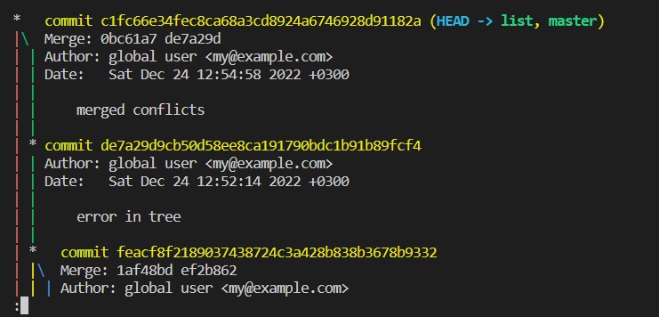

# Seminar 1 - 3. Shelginskikh version
## 1. Commands git 
* git add , --> adding new files in GIT
* gitt commit -m "text"--> create commit, where '-m' is pointer for creating text in comma
* git init --> initializing git system into folder
* git diff --> show difference between last commit and modify files
* git status --> show current anchanged modify 
* git log --> show info for branch, data and author
* git checkout 'number commit' --> select wanted commit or branch, or back to master 
* git help --> show all command in git
* git branch --> show actual branches
## 2. Commands MarkDown ##
* #_# - double symbols # create heder
* ~~text~~ - created by ~~ text ~~  
* *coursive* - write --> * coursive *
* ***bold*** - write --> *** bold ***
* ***coursive+bold*** - write --> *** text *** 
* > a blockquote - write '>' or '>>' before text
- -  --> write '-' after '*' or '-'
* adding URL for image -->    

>URL for Markdown official site  -->  https://www-markdownguide-org.translate.goog/basic-syntax/?_x_tr_sl=auto&_x_tr_tl=ru&_x_tr_hl=ru

>URL from seminar 1
>> https://habr.com/ru/post/541258/  
>> https://habr.com/ru/post/542616/
>
# #

# Lecture 2 #

## Branches
creat new branch ==> git branch text_formatting 

## Links
<a href="https://www.markdownguide.org" target="_blank">Learn Markdown!</a>

## images

something changes

## Seminar 3
>Here section we should describe instructions about the GitHub work process. Below the instruction for Fork working method is provided.
1. Open GitHub via an external link from 
2. Create a new repository. Note about sections:
* Name
* Access (public or private)
* fork selection
* .gitignore selection (templates are available)
3. Review git commands for local connection provided by GitHub
4. Create a new folder in your local PC (opened throw the VS code studio)
5. Create *README.md* file (if unavailable by default)
6. Create a local repository (use commands from step 3)
7. Check your status with the command *git status*
8. Create your local branch in your fork (note that you are in the master branch by default)
9. With command *git checkout*  switch to your local branch
10. Make needed changes
11. Create your local branch in the remote server *git push -u origin "branch name"* (note you haven't local branch in remote)
12. Send your changes to a remote server by command *git push*
13. Check in GitHub that your branch is created
14. Make *pull request* for merge request to the origin master branch 
15. Have fun! 

# Almas thank you for lessons! 
